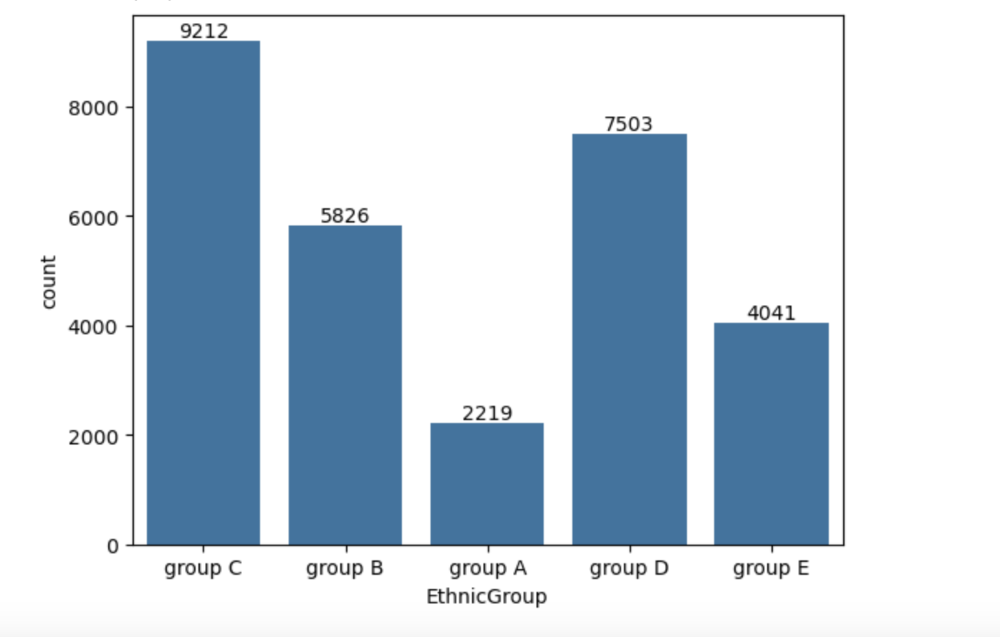
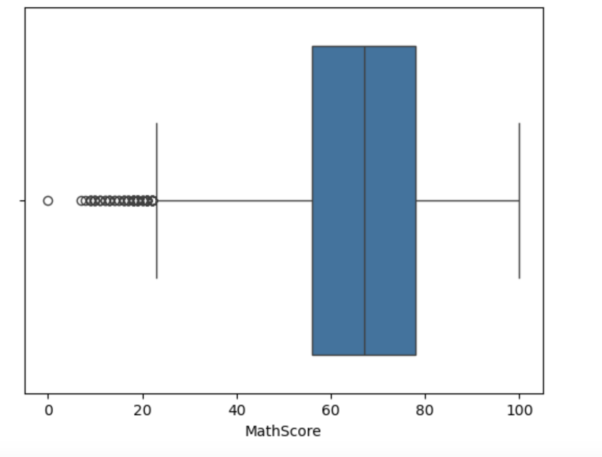
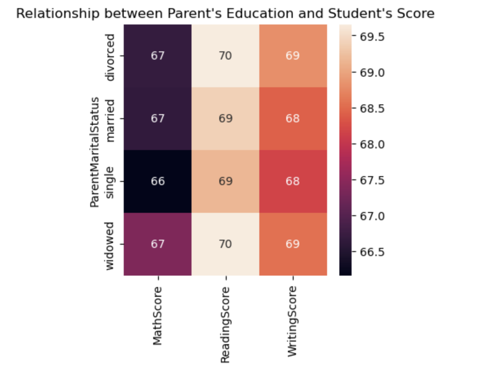
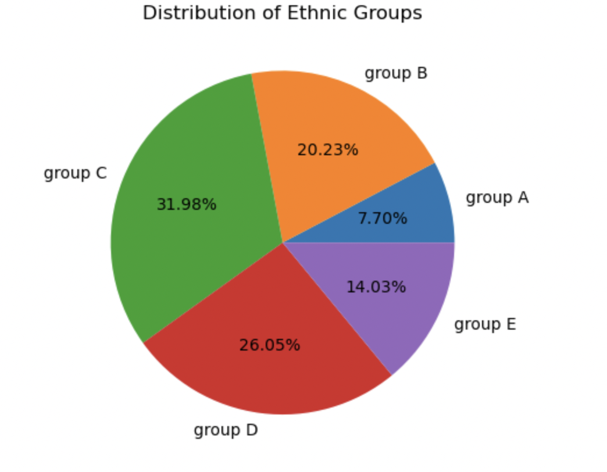

# Student Score Data Visualization

This project involves the visualization of student scores using various charts and diagrams to gain insights into the performance and distribution of scores.

## Introduction

This project focuses on visualizing student scores using various charts and diagrams, aiming to provide insights into their performance and score distribution. By employing different visualization techniques such as count plots, box plots, heat maps, and pie charts, we can effectively analyze and interpret the data to understand trends, patterns, and correlations among different subjects and categories.

## Features

- Visualize student scores using various chart types.
- Analyze the distribution of scores.
- Identify trends and patterns in student performance.
- Compare scores across different subjects or time periods.

## Installation

This project may require the following dependencies:

- Python (version X.X)
- matplotlib
- seaborn
- pandas

To install the required dependencies, you can use pip:

## Usage

1. Clone the repository to your local machine.
2. Navigate to the project directory.
3. Run the script or notebook containing the visualization code.
4. Explore the generated charts and diagrams to analyze student scores.

## Screenshots

### Count Plot

*Count plot showing the distribution of scores across different subjects.*

### Box Plot

*Box plot showing the distribution of scores across different subjects.*

### Heat Map

*Heat map showing the correlation between different subjects.*

### Pie Chart 

*Pie chart demonstrating the distribution of scores across different categories.*

## Contributing

Contributions are welcome! If you'd like to contribute to this project, please fork the repository and submit a pull request with your proposed changes.

## License

This project is licensed under the [MIT License](LICENSE).
